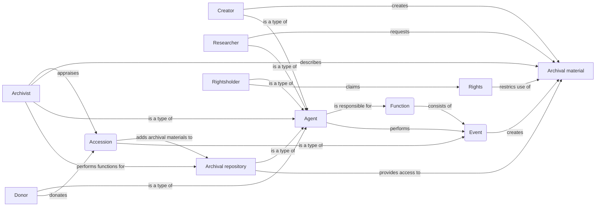
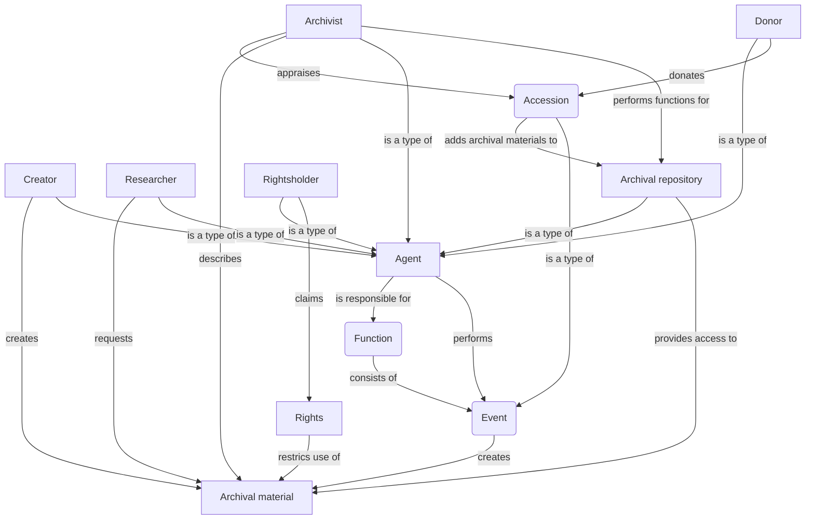
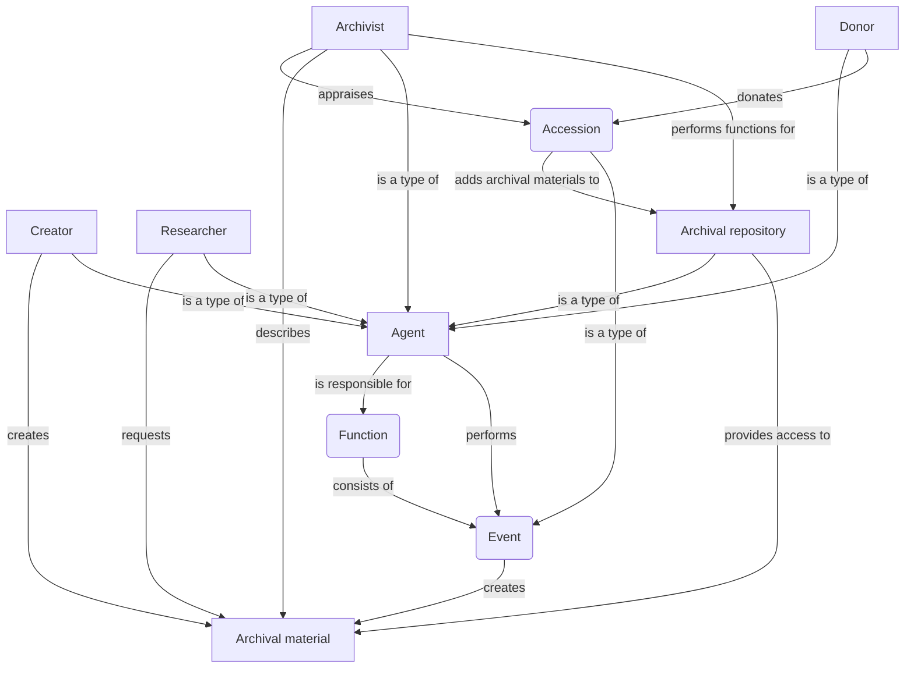
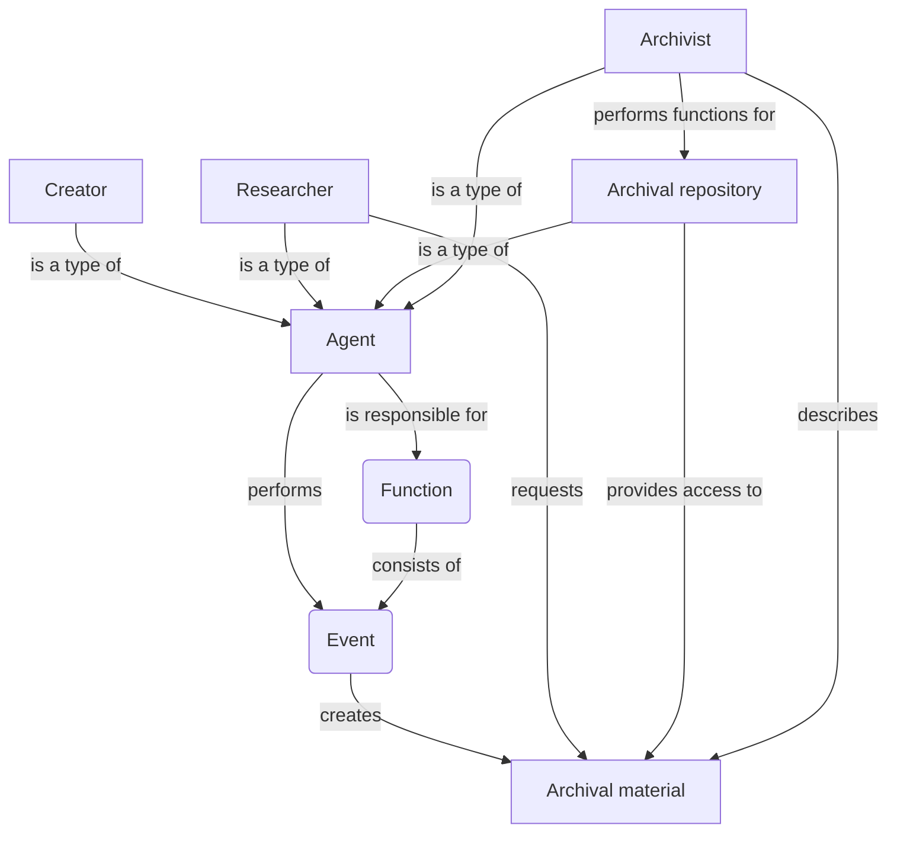
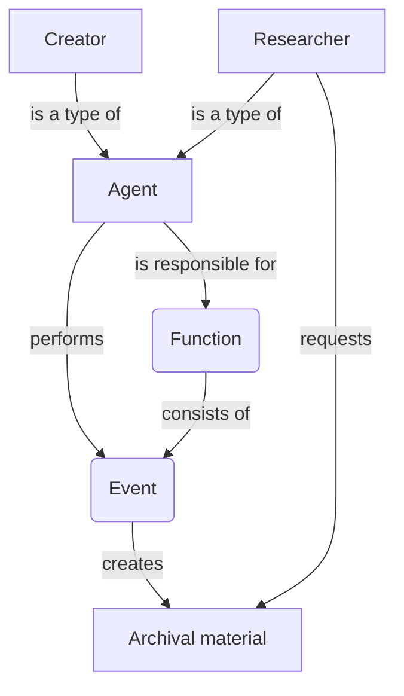
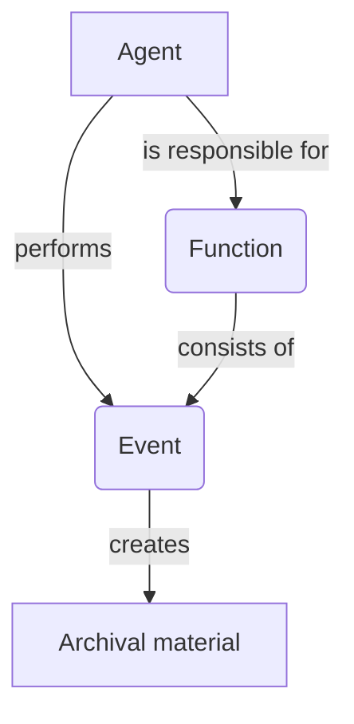

Arkly is developing using [Domain-Driven Design](https://en.wikipedia.org/wiki/Domain-driven_design) (DDD) principles. That includes establising a clear domain model in which the software system operates.

# Arkly domain diagram

## Version 6

## Version 5

## Version 4

## Version 3

## Version 2

## Version 1

